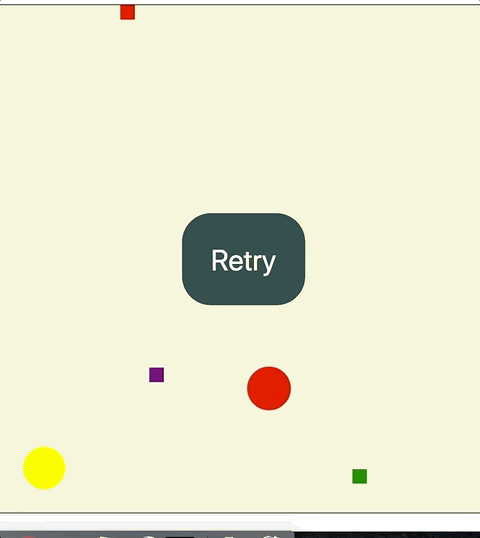

# Shakey Snakey

[Live Link](https://mrmoeee.github.io/shakey_snakey/)

Features a snake game, with poison/antidote food interactions between two types of Snake Food Objects, and random obfuscations.


### Features - Visual Obfuscations
Random obfuscations are spawned depending on how many loops have been requested by:
```js
window.requestAnimationFrame(animationLoop);
```


Visual obfuscations spawn in from all four sides.
The randomness of each asteroid occurs because I am passing in options hash to the constructor with predetermined values that are generated similarly to how I am generating a random color.
Math.random() will be multiplied with the amount of colors implemented have. (currently 3);

```js
//Asteroids class
constructor(options = {}) {
    this.x = options.x;
    this.y = options.y;
    this.xspeed = options.xspeed;
    this.yspeed = options.yspeed;
    this.radius = options.radius;
    this.color = this.generateColor();
  }
generateColor() {
    let num = Math.floor(Math.random() * 3);
    return COLORS[num];
  }
```
### Object-oriented programming


There will only ever be 3 food objects on the canvas with different attributes. I generated there food objects like so:
```js
//feedingGround constructor
this.snakeFood = [
      new SnakeFood(20, 20, 'green', 10),
      new SnakeFood(20, 20, 'red', 40),
      new SnakeFood(20, 20, 'purple', 100)
    ];
```
The most important one is the color that I give each food, as that determines what events my take place when it collides with the snake and allows the snake to eat the object. For example:

##### Scoring
If players eat the red food object, before the purple food object, they will gain a massive increase to their score.
```js
//Snake Constructor
isPoisoned() {
  if (this.eaten === 'purple') {
    this.direction = this.reverse;
    return true;
  } else {
    return false;
  }
}
```
In the above code snippet, after the snake eats a food object, I change the snakes 'eaten' variable to that color, and the color determines what happens, in this case purple is poisonous, and will reverse your controls.

Each food object also spawns randomly as I generate random 2D positions that are within the boundaries of the canvas.
```js
//feedingGround random food spawn logic
spawnFood(food) {
  const boundsW = Math.floor(this.width/20);
  const boundsH = Math.floor(this.height/20);
  let col = Math.floor(Math.random() * boundsW);
  let row = Math.floor(Math.random() * boundsH);
  food.x = col;
  food.y =
```

Bonus Features:
- [ ] Include collision with visual obfuscations to force players to not only pay attention to where they are on the canvas, and also to dodge incoming obfuscations.
